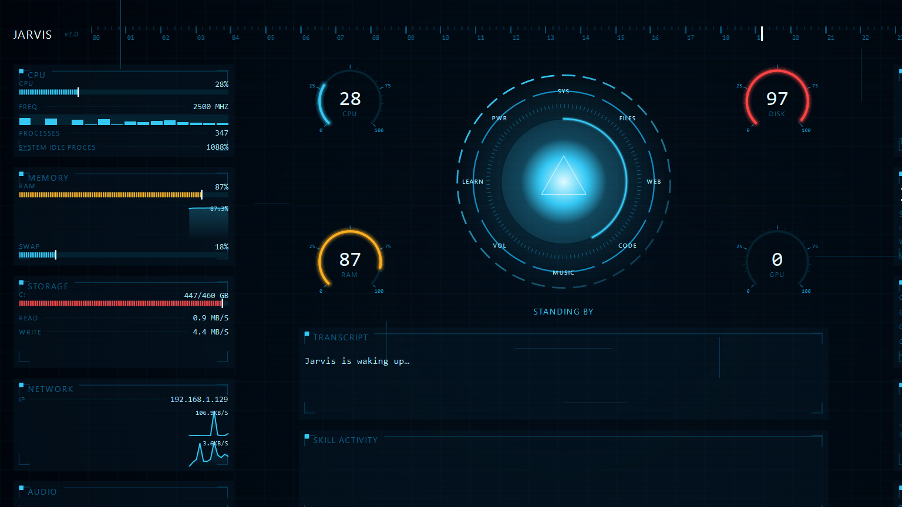

# Jarvis — Personal AI Desktop Assistant (Windows)


A modular Jarvis-style assistant: talk or type to it, and it uses an LLM to
understand you and calls real "skills" to control your PC — opening apps,
checking system stats, reading your screen, searching the web, volume, power
controls, notes, reminders, durable memory, deep research it remembers
permanently, recurring scheduled tasks like a morning briefing, news
headlines from any RSS/Atom feed, and remote control from your phone over
Telegram or Discord.

A single message can bundle several steps or several distinct asks — "open
Instagram in Opera GX, find so-and-so in my DMs, and message them" — and
Jarvis works through the whole chain with as many tool calls as it takes,
looking at the screen between steps rather than guessing.

It runs as a desktop HUD — an always-on-top arc reactor orb that sits on your
desktop, and a full-screen glass interface you summon from it — with a live
trace of every tool call as a multi-step task runs, plus panels for the
skills registry and the knowledge base — or as a plain terminal loop when
you'd rather not have a window.

Any endpoint speaking the OpenAI chat-completions protocol works (Gemini's
compatibility endpoint, OpenRouter, DashScope/Qwen, a local server), the
native Anthropic API when `MODEL` names a Claude, and Amazon Bedrock when
`MODEL` starts with `bedrock/` (section 2).



## Contents

1. [Install](#1-install)
2. [Configure](#2-configure)
3. [Run](#3-run)
4. [Project layout](#4-project-layout)
5. [Safety](#5-safety)
6. [Hand-gesture cursor control](#6-hand-gesture-cursor-control)
7. [Browser automation](#7-browser-automation)
8. [Adding a new skill](#8-adding-a-new-skill)
9. [Tests](#9-tests)
10. [Configuration reference](#10-configuration-reference)
11. [Email and calendar setup](#11-email-and-calendar-setup)
12. [Scheduled proactive tasks](#12-scheduled-proactive-tasks)
13. [Remote control: Telegram and Discord](#13-remote-control-telegram-and-discord)
14. [Roadmap ideas](#14-roadmap-ideas)
15. [License](#15-license)

## 1. Install

Requires **Python 3.10+** on Windows. Run from a Windows shell, not WSL —
`os.startfile`, `pycaw`, and the audio devices don't exist there.

```bat
cd Jarvis
python -m venv venv
venv\Scripts\activate
pip install -r requirements.txt
```

That one file covers everything, including the heavier optional stacks below
— Jarvis still runs fine at runtime if any of them are missing, it just
degrades that one feature instead of failing to start. Notably:

- Hands-free voice pulls ~1GB of ML wheels (`faster-whisper`, ...).
- The `deep_learn` skill (research a topic in depth and remember it
  permanently) and semantic recall for the `memory` skill both need a local
  vector store and embedding model — `sentence-transformers` pulls in torch.
  Without it, `deep_learn` just says what's missing instead of failing, and
  `memory` recall falls back to plain-text search; nothing else in Jarvis is
  affected.
- Email and calendar (`read_email`, `send_email`, `list_events`,
  `create_event`, `delete_event`) still need one Google or Microsoft account
  connected before they do anything — see section 11 below.

`web_search` needs no setup at all — it runs on DuckDuckGo via the `ddgs`
package (already in `requirements.txt`), with no API key, signup, or billing.

**GPU acceleration.** Both local models — `faster-whisper` (speech-to-text)
and `sentence-transformers` (memory/knowledge embeddings) — use an NVIDIA GPU
automatically when one's usable, which is what keeps voice responsive instead
of laggy. Startup prints what each actually loaded on (`[stt] ... loaded on
cuda ...` / `[embeddings] ... loaded on cuda:0`) so you can confirm it. If
that says `cpu` on a machine with an NVIDIA GPU, the plain `pip install -r
requirements.txt` almost always picked a CPU-only build:
- **faster-whisper**: needs the CUDA 12 runtime + cuDNN 9 on `PATH`, or just
  `pip install nvidia-cublas-cu12 nvidia-cudnn-cu12` alongside this project.
- **sentence-transformers**: needs a CUDA-enabled `torch` build. PyPI's
  default `torch` wheel is CPU-only on Windows — install torch from
  [pytorch.org/get-started/locally](https://pytorch.org/get-started/locally/)
  *before* `pip install -r requirements.txt` (pip won't downgrade an
  already-satisfied dependency).

## 2. Configure

```bat
copy .env.example .env
```

Edit `.env` and point it at a provider. Three keys do all the work:

```ini
API_KEY=your_key_here
BASE_URL=https://generativelanguage.googleapis.com/v1beta/openai/
MODEL=gemini-3.6-flash
```

Swap in OpenRouter (`https://openrouter.ai/api/v1`), DashScope, or anything
else that speaks the same protocol. Leave `BASE_URL` blank and set
`MODEL=claude-opus-5` to use Anthropic directly, which additionally gets
adaptive thinking, prompt caching, and server-side web search.

**Amazon Bedrock**, if you'd rather bill Claude through AWS: set
`MODEL=bedrock/<bedrock-model-id>` (e.g.
`bedrock/us.anthropic.claude-haiku-4-5-20251001-v1:0` — Bedrock's newer Claude
models generally need the region-prefixed cross-region inference profile id,
not the bare model id; check the Bedrock console's Model catalog for the
exact ids your account can see) and `AWS_REGION`. Auth is an AWS Bedrock API
key — a bearer token from the Bedrock console, no IAM access-key/secret pair
needed — set as `AWS_BEARER_TOKEN_BEDROCK`; boto3 reads it straight from the
environment, so nothing else needs to reference it. Needs
`pip install "anthropic[bedrock]"` (already in `requirements.txt`). Getting
`"Access to Anthropic models is not allowed from unsupported countries,
regions, or territories"` on every call despite the key clearly working
(e.g. `list_foundation_models` succeeds)? That's an AWS-account-level
eligibility check on the account's registered country, not a Jarvis or
network issue — check AWS Console → Billing and Cost Management → Payment
preferences for the account's country.

Reasoning depth is `EFFORT`. A model with no reasoning control rejects the
parameter; Jarvis notices on the first turn and drops it for the session, so
you don't have to know in advance which models support it.

## 3. Run

```bat
python app.py        REM desktop HUD
python main.py       REM terminal only
```

The HUD opens full-screen and leaves an orb on your desktop when you press
**Esc**. Click the orb, double-click the tray icon, or press **Ctrl+Alt+J** to
bring it back. The orb shows what Jarvis is doing: a molecular field of
particles drifts inside it, bonding to whichever neighbours they're near —
calm and slow when idle, stirred up and open while it's working or speaking.

Voice is the main way to talk to the HUD: on launch, Jarvis speaks a greeting
and listens right away for your first request — no wake phrase needed yet,
since it just finished talking. After each request it goes back to sleep;
say your assistant's name and **"wake up"** to bring it back for the next one.

- **Text mode**: type and hit Enter.
- **Voice mode**: `/mode voice`, then just say your assistant's name and
  **"wake up"** (e.g. **"ODIN, wake up"**) — no key press. Falls back to
  press-Enter-to-talk if the speech models aren't available.

Commands: `/undo`, `/mode voice`, `/mode text`, `/reset`, `/connect google`,
`/connect microsoft`, `/help`, `/quit`

In voice mode, talking over Jarvis mid-reply cuts it off and is heard as the
next thing you said — no need to wait for it to finish. This has no acoustic
echo cancellation, so it works best with headphones; over open speakers,
Jarvis's own voice coming back through the mic can occasionally trigger it
(raise `BARGE_IN_THRESHOLD` if that happens).

In the HUD, the **KNOWLEDGE** button opens a panel to browse what's been
deep-learned and kick off research on a new topic in the background; **SETTINGS**
shows every registered skill and the behaviour toggles that are safe to flip
without restarting (shell/input-control changes still need a restart). While a
turn is running, each tool call streams into the chat feed as it starts and
resolves — visible progress through a multi-step task instead of a silent
spinner — and the orb pulses a distinct color while it's actively driving the
machine versus just thinking.

## 4. Project layout

```
Jarvis/
  app.py                  desktop entry point: orb + HUD
  main.py                 terminal run loop, voice state machine, confirmations
  config.py               loads .env settings
  ui/
    molecule.py           the 3D particle-and-bond field both orbs float inside them
    orb.py                the small ambient orb: rings, nucleus, molecular field
    app_window.py         OrbWindow, the always-on-top desktop orb that summons the HUD
    panels.py             settings/skills dialog and the knowledge browser
    workers.py            Qt <-> brain threading seam
    hud/                  the full-screen instrument HUD (native PyQt6, built to ODIN-HUD.md)
      window.py             OdinHudWindow: assembles the zones, owns the one shared ~30fps animation tick
      voice_orb.py          VoiceOrb, the HUD's centerpiece: rings + launcher ring + molecular field
      zones.py              one builder per grid zone (telemetry panels, transcript, dock, launcher)
      layout.py             the CSS-grid-style zone geometry the HUD is assembled from
      tokens.py             every color/glow/font/duration used under ui/hud/ — the one design-tokens file
      widgets.py            Panel, Readout, BarMeter, DockButton, TickRuler
      radial_gauge.py       the four gauges flanking the orb (CPU/RAM/DISK/GPU)
      instruments.py        the side panels' widgets: scrolling history graphs, hero
                            numerals, arc gauges, process rows, forecast strip, battery
      spectrum.py           zone K's live audio-loopback analyser
      telemetry.py          QThread sampling CPU/RAM/disk/network into one frame per tick
      telemetry_view.py     renders telemetry/weather onto the HUD's zone widgets
      voice_loop.py         wake/listen/sleep state machine, mode switching (text <-> voice)
      weather.py            structured weather (temp, humidity, forecast) for zone G
      boot.py               the ~4.2s orchestrated startup animation
      confirm.py            the DANGEROUS-tier confirmation banner
      console.py            typed-input overlay, a convenience surface over the same bridge
  core/
    brain.py              talks to the LLM, runs the tool-use loop
    risk.py               SAFE / MODERATE / DANGEROUS, shell command classifier
    undo.py               undo journal and the trash behind file recovery
    store.py              SQLite: conversation, notes, reminders, memories, knowledge manifest
    knowledge.py           local vector store for deep_learn (chunk, embed, retrieve)
    embeddings.py          shared sentence-embedding model (knowledge.py + memory_index.py)
    memory_index.py        semantic search index behind the memory skill's recall
    research.py            deep_learn's agentic pipeline: decompose, research, self-check
    email_providers.py     Gmail/Calendar and Outlook/Calendar OAuth + API backends
    env_file.py            .env read/update helper for the settings panel
    scheduler.py           durable reminders, and recurring scheduled tasks (survive restarts)
    security.py            secret/PII scanner and untrusted-content injection scanner
    rate_limit.py           token-bucket throttle for web_fetch/http_request/get_news
    telegram_channel.py    optional Telegram bridge: text Jarvis from your phone
    discord_channel.py     optional Discord bridge: same idea, over Discord's Gateway
    audio.py              shared 16 kHz microphone stream
    wake.py               "<name>, wake up" wake trigger (faster-whisper phrase match)
    barge_in.py            interrupt Jarvis mid-sentence by talking over it
    speech_input.py       microphone -> text (faster-whisper, local)
    speech_output.py      text -> speech (edge-tts, SAPI fallback)
    gesture.py             hand-gesture cursor control: camera, tracking, GestureController
    browser.py             DOM-driven browser automation: Playwright thread, element refs
  skills/
    base_skill.py         base class every skill implements
    skill_manager.py      registers skills, exposes them as tools
    system_skills.py      open/close apps, volume, power, system info
    file_skills.py        read, list, search, write, move, delete, read PDFs
    shell_skills.py       run_command (arbitrary shell)
    window_skills.py      list, focus, minimise/maximise, close windows
    input_skills.py       type text, press keys, click, scroll
    gesture_skills.py      hand_control: voice/text on/off for hand-gesture cursor control
    browser_skills.py      browser_navigate/read/click/type/scroll/close: drive web pages by element
    web_skills.py         open website (optionally in a specific browser), browser search, fetch a page, weather, web_search, call REST APIs/webhooks, get_news (RSS/Atom)
    vision_skills.py      screenshot -> the model can see your screen
    knowledge_skills.py    deep_learn, list_learned_topics
    email_skills.py        read_email, send_email, list_events, create_event, delete_event
    utility_skills.py     time/date, notes, reminders, scheduled tasks, memory, clipboard, calculator, wait
  tests/                  pytest suite (runs without voice, RAG, or email deps, and on Linux)
```

## 5. Safety

Jarvis uses a three-tier risk model (`SAFE`, `MODERATE`, `DANGEROUS`):
- **SAFE** actions (reading files, listing windows, system info, weather) run silently.
- **MODERATE** actions (writing files, moving files, focusing windows, typing) run immediately and generate a single-use undo token (`/undo`).
- **DANGEROUS** actions (`power_control` shutdown/restart, `close_app`, `delete_file`, overwriting sensitive paths) ask for explicit user confirmation first. Spoken confirmation defaults to NO on ambiguity or silence.

Deleted and overwritten files are backed up to Jarvis's local trash first, making file operations recoverable via `/undo`.

`close_app` matches process names exactly and refuses to touch critical
Windows processes (`lsass`, `csrss`, `winlogon`, …).

A scheduled task (section 12) or a message over Telegram/Discord (section 13)
runs with nobody there to answer a confirmation prompt, so all three
auto-decline every DANGEROUS action instead of asking — the same "default to
no" rule the interactive prompts already use for silence or an unparsable
answer, just unconditional. Don't schedule or remote-trigger anything that
depends on a confirmation going through; do it locally instead.

`read_file`, `run_command`, `web_fetch`, `http_request`, and `get_news`
results are also scanned for things that look like API keys, passwords, or
tokens before they reach the model — see `SECURITY_SCAN_MODE` in section 10.

Content that came from outside the machine (`web_fetch`, `http_request`,
`get_news` — never a local file or `run_command`'s own output) gets a second
pass: a check for text that reads like an attempt to redirect the model
("ignore all previous instructions", role-delimiter injection, and similar).
Nothing is withheld — the fix for a hostile web page isn't hiding it, it's
telling the model plainly that what follows is data to read, not commands to
follow — but a warning note is prepended and the match is logged the same
way a secret match is.

`web_fetch`, `http_request`, and `get_news` also share a token-bucket rate
limit (`RATE_LIMIT_PER_MINUTE` / `RATE_LIMIT_BURST` in section 10) so a
runaway loop or a page whose injected text says "fetch this 50 times" can't
hammer a target unattended — `MAX_TOOL_ITERATIONS` already bounds one turn's
tool calls, this bounds calls across turns and across the whole run.

## 6. Hand-gesture cursor control

Point a webcam at your hand and drive the literal OS cursor with it — point to
move; pinch thumb-and-index to click (hold to drag), thumb-and-middle to
right-click, thumb-and-ring to double-click, thumb-and-pinky to middle-click;
hold up index-and-middle and move up/down to scroll, or index-middle-and-ring
and move your thumb in/out to zoom; swipe an open palm sideways to switch
windows (Alt+Tab). Holding a palm still, or a fist, pauses tracking without
letting go of anything mid-gesture.

Off by default (`ENABLE_GESTURE_CONTROL=0` in `.env`) — turning it on
activates your webcam. Once enabled, there are two ways to start it:

- **HUD/tray**: right-click the tray icon → **Toggle hand control**. Instant,
  no confirmation — a deliberate click already is your consent.
- **Voice/text**: say or type "turn on hand control". This goes through the
  same confirmation flow as any other `DANGEROUS` action, since this path can
  be reached by a mishearing. Turning it back **off** is always instant on
  either path — never gated behind a prompt.

Needs `opencv-python` and `mediapipe` (see `requirements.txt`); without them
it reports what's missing instead of failing to start. No frame is ever
written to disk or sent anywhere, including to the model — this subsystem
never touches the LLM. `pyautogui`'s corner failsafe stays on, so slamming the
cursor into a screen corner still aborts everything, exactly as it does for
the ordinary `click`/`type_text` skills in section 5.

## 7. Browser automation

The README's own opening example — *"open Instagram in Opera GX, find
so-and-so in my DMs, and message them"* — used to run entirely through the
vision loop: screenshot the screen, send the image to the model, get pixel
coordinates back, click them, screenshot again. It worked, and it took about
five minutes, because that one request needs 10–20 sequential round trips and
every one of them carries a full screenshot.

This does the same job by talking to the page instead of looking at it.
`browser_navigate` opens a site and returns a compact text list of its
interactive elements, each with a ref:

```
[1:0] link "Home"
[1:4] searchbox "Search"
[1:9] button "Send message"
```

`browser_click`, `browser_type`, and `browser_scroll` take those refs.
No image tokens, no vision reasoning, and no coordinate guessed off a
screenshot that may already be stale. `browser_read` re-lists the page after
anything changes it — refs carry a generation tag, so one remembered from an
earlier listing fails cleanly rather than clicking whatever now sits in that
slot.

It does **not** replace the vision path. Native apps still need pixels, and so
does anything a page draws rather than describes — video, canvas, an image
with no alt text. The browser it drives is a real window, so `see_screen` and
the pixel `click` from section 5 work on it as a fallback.

**Setup.** Off by default (`ENABLE_BROWSER_AUTOMATION=0`), and it needs a step
`pip install -r requirements.txt` does not cover:

```bash
pip install playwright
playwright install chrome
```

The tools stay unregistered unless the flag is on **and** the package imports,
so turning the flag on before installing anything can't put a
guaranteed-to-fail tool in front of the model.

**Logging in.** The browser is visible, not headless, and keeps its own
profile under `data/browser_profile/`. The first time you go somewhere that
needs an account, log in yourself in that window — 2FA, CAPTCHA, whatever the
site asks. The session persists across ODIN restarts. Nothing here handles or
stores credentials; that window is yours.

**Risk.** `browser_click` / `browser_type` / `browser_scroll` sit at
`MODERATE`, the same tier as the `click` / `type_text` / `scroll` skills they
mirror, and for the same reason: you cannot un-send a message, so none of them
record an undo token and all three say so. `browser_close` is never gated,
whatever `CONFIRM_DESTRUCTIVE` says — the one thing this must never do is
refuse to shut itself off. Closing keeps the profile, so reopening doesn't ask
you to sign in again.

## 8. Adding a new skill

1. Subclass `BaseSkill` in a file under `skills/`:

```python
from .base_skill import BaseSkill
from core.risk import Risk

class MyNewSkill(BaseSkill):
    name = "my_new_skill"
    description = "One sentence the model uses to decide when to call this."
    input_schema = {
        "type": "object",
        "properties": {"param": {"type": "string"}},
        "required": ["param"],
    }
    risk = Risk.SAFE

    def run(self, param: str) -> str:
        return "Result to speak back to the user."
```

2. Register it in `skills/skill_manager.py` (import + add to `SKILL_CLASSES`).

That's it. A skill can also return image content blocks instead of a string —
see `vision_skills.py` — and they're converted correctly for both providers.

## 9. Tests

```bat
python -m pytest tests/ -v
```

650+ tests, no API key and no microphone needed. They also run on Linux/WSL,
which is useful because the voice stack won't. The HUD tests use Qt's offscreen
platform, so they need no display either.

## 10. Configuration reference

| Variable | Default | What it does |
|---|---|---|
| `API_KEY` / `BASE_URL` / `MODEL` | — | The provider. Provider-prefixed aliases (`GEMINI_*`, `OPENROUTER_*`, …) also work. `MODEL=bedrock/<id>` selects Amazon Bedrock instead (section 2) |
| `AWS_BEARER_TOKEN_BEDROCK` / `AWS_REGION` | — / `us-east-1` | Amazon Bedrock auth (a bearer-token API key) and region. Only used when `MODEL` starts with `bedrock/` |
| `EFFORT` | `low` | Reasoning depth, or `off`. Dropped automatically if the model rejects it |
| `MAX_TOKENS` | `8192` | Ceiling on thinking + reply, not a target length |
| `MAX_TOOL_ITERATIONS` | `25` | Tool round-trips before giving up on a turn — a compound, multi-step request can easily need a dozen-plus |
| `ENABLE_SHELL` | `1` | Master switch for `run_command` |
| `ENABLE_INPUT_CONTROL` | `1` | Master switch for typing/clicking |
| `ENABLE_GESTURE_CONTROL` | `0` | Master switch for hand-gesture cursor control (section 6). Off by default — activates a webcam |
| `GESTURE_CAMERA_INDEX` | `0` | Which capture device to open |
| `GESTURE_FPS_LIMIT` | `30` | Caps how often frames are processed |
| `GESTURE_SMOOTHING` | `0.5` | Cursor-position smoothing factor |
| `GESTURE_CLICK_HOLD_MS` | `250` | Pinch-tap (click) vs. pinch-and-hold (drag) threshold |
| `ENABLE_BROWSER_AUTOMATION` | `0` | Master switch for DOM-driven browser automation (section 7). Off by default, and inert until `playwright install chrome` has been run |
| `BROWSER_CHANNEL` | `chrome` | Which Chromium build to drive. `""` or an uninstalled channel falls back to the Chromium Playwright bundles |
| `BROWSER_NAV_TIMEOUT_SECONDS` | `30` | How long a page load may take before the call gives up |
| `BROWSER_ACTION_TIMEOUT_SECONDS` | `15` | How long a click/type/scroll may wait for its element |
| `BROWSER_MAX_ELEMENTS` | `60` | How many interactive elements one `browser_read` lists |
| `MAX_HISTORY_MESSAGES` | `80` | Live request context cap. Full history stays in SQLite |
| `MEMORY_CONTEXT_LIMIT` | `5` | Durable facts injected alongside the newest turn |
| `KNOWLEDGE_CONTEXT_RESULTS` | `4` | deep_learn notes chunks injected per turn when relevant. `0` disables retrieval |
| `HUD_HOTKEY` | `ctrl+alt+j` | Global summon key (needs the `keyboard` package). `off` to disable |
| `CONFIRM_TIMEOUT_SECONDS` | `120` | HUD only: an unanswered confirmation counts as no |
| `MS_OAUTH_CLIENT_ID` | — | Enables the Microsoft-backed email/calendar skills once connected. See section 11 |
| `MS_OAUTH_TENANT_ID` | `common` | Azure tenant for the Microsoft OAuth app; `common` covers both personal and work/school accounts |
| `UNDO_WINDOW_SECONDS` | `900` | How long an action stays undoable |
| `TRASH_MAX_ENTRIES` | `200` | Deleted-file backups kept, by count |
| `TRASH_MAX_AGE_DAYS` | `7` | Deleted-file backups kept, by age |
| `WAKE_WORD` | `on` | Say `ASSISTANT_NAME` + "wake up" to wake Jarvis. Set `off` for push-to-talk |
| `STT_MODEL` | `base.en` | Whisper size. `small.en` is better if your CPU allows |
| `STT_DEVICE` | `auto` | `auto` \| `cpu` \| `cuda`. `auto` uses an NVIDIA GPU automatically when one's usable — the fix for voice lag on a GPU machine |
| `STT_COMPUTE` | `auto` | Numeric precision to pair with `STT_DEVICE`. `auto` picks the fastest type this device actually supports (float16+ on GPU, int8 on CPU) |
| `TTS_ENGINE` | `auto` | `edge` (natural, needs net), `sapi` (offline), `off` |
| `TTS_VOICE` | `en-GB-RyanNeural` | Any edge-tts voice |
| `VAD_SILENCE_SECONDS` | `0.8` | Silence before Jarvis stops recording |
| `BARGE_IN_THRESHOLD` | `0.05` | RMS level that counts as "the user is talking over Jarvis." No echo cancellation — raise this if playback through open speakers triggers it |
| `SECURITY_SCAN_MODE` | `redact` | Scans `read_file`/`run_command`/`web_fetch`/`http_request`/`get_news` output for secrets, and web-sourced content for prompt injection, before either reaches the model. `off`, `warn` (log only), `redact`, or `block` (secrets only — injection only ever warns) |
| `RATE_LIMIT_PER_MINUTE` | `30` | Throttle on `web_fetch`/`http_request`/`get_news`, shared across every caller. `0` disables it |
| `RATE_LIMIT_BURST` | `10` | Token-bucket burst capacity paired with `RATE_LIMIT_PER_MINUTE` |
| `TELEGRAM_BOT_TOKEN` | — | Enables the Telegram bridge (section 13) once set |
| `TELEGRAM_CHAT_ID` | — | Locks the Telegram bridge to one chat. Left to the bot's first reply to tell you — see section 13 |
| `DISCORD_BOT_TOKEN` | — | Enables the Discord bridge (section 13) once set. Needs the optional `discord.py` package |
| `DISCORD_CHANNEL_ID` | — | Locks the Discord bridge to one channel. Left to the bot's first reply to tell you — see section 13 |
| `RSS_FEEDS` | — | Comma-separated default feed URLs for `get_news` when no feed is named |
| `DEBUG` | `0` | Print token usage and cache hit rates |

## 11. Email and calendar setup

`read_email`, `send_email`, `list_events`, `create_event`, and `delete_event`
need one connected account (the packages are already in `requirements.txt`).
Neither provider is registered as a skill at all until it's at least set up
enough to attempt a connection — see `skill_manager.py`'s gating.

**Google** (Gmail + Calendar):
1. In [console.cloud.google.com](https://console.cloud.google.com), create an
   OAuth client ID of type **Desktop app**, and enable the Gmail and Calendar
   APIs for the project.
2. Download the client JSON and save it as `data/oauth/google_credentials.json`.
3. Run Jarvis and type `/connect google` — a browser window opens for consent.
4. Restart Jarvis. The Google-backed skills are now available.

**Microsoft** (Outlook + Calendar, via Graph):
1. In [portal.azure.com](https://portal.azure.com), register an app as a
   **public client** (no secret), and add the `Mail.Read`, `Mail.Send`, and
   `Calendars.ReadWrite` delegated permissions.
2. Set `MS_OAUTH_CLIENT_ID` in `.env` to the app's Application (client) ID.
3. Run Jarvis and type `/connect microsoft` — it prints a URL and a code to
   enter in a browser (device-code flow, so no redirect URI to configure).
4. Restart Jarvis. The Microsoft-backed skills are now available.

Both accounts can be connected at once — Jarvis asks which one to use for a
given request only when it's genuinely ambiguous. Tokens live under
`data/oauth/`, which is already covered by `.gitignore`.

## 12. Scheduled proactive tasks

Beyond one-off reminders, Jarvis can run a full turn on a recurring schedule —
"every weekday at 8am, check my email and calendar and give me a morning
briefing." Just ask, in text or voice:

> "Every weekday at 8am, check my email and give me a briefing."

This calls the `schedule_task` skill, which stores a prompt plus a schedule
(`daily HH:MM`, `weekdays HH:MM`, `weekends HH:MM`, or a day list like
`mon,wed,fri 18:30`, all in 24-hour local time). `core/scheduler.py`'s
`TaskScheduler` polls for due tasks every 15 seconds and, when one fires,
runs `prompt` exactly as if you'd typed it — every tool it needs is
available, and the reply is spoken/shown the same way a normal turn's is.

A task that fires while Jarvis was closed is **not** caught up on restart —
it resumes from "next slot after now," so reopening Jarvis after a few days
off doesn't dump a backlog of stale briefings on you. Ask to "list scheduled
tasks" or "remove scheduled task #2" to manage them. As with any unattended
run, confirmations are auto-declined (see section 5) — don't schedule
anything that depends on one going through.

## 13. Remote control: Telegram and Discord

Text Jarvis from your phone and get replies back, with every skill available
exactly as in text mode. Both bridges are off unless their bot token is set,
and both are locked to one chat/channel the same way — until the id is set,
the bot replies to a first message with the id to paste into `.env`; once
set, every other chat/channel is silently ignored, not even acknowledged.

**Telegram** — talks to Telegram's plain HTTPS Bot API directly, no extra
package needed:
1. Message [@BotFather](https://t.me/BotFather) on Telegram, send `/newbot`,
   and follow the prompts. Paste the token it gives you into `.env` as
   `TELEGRAM_BOT_TOKEN`.
2. Restart Jarvis, then message your new bot once. It replies with the chat
   id to paste into `TELEGRAM_CHAT_ID` in `.env`.
3. Restart again. The bridge is live — message the bot from anywhere.

**Discord** — needs the optional `discord.py` package (already in
`requirements.txt`), since Discord bots only receive messages over a
persistent Gateway websocket rather than Telegram's simple long-poll API:
1. Create an app + bot at
   [discord.com/developers/applications](https://discord.com/developers/applications),
   enable **Message Content Intent** under the Bot tab, and paste the bot
   token into `.env` as `DISCORD_BOT_TOKEN`. Invite the bot to a server (or
   just DM it — either works).
2. Restart Jarvis, then message the bot once. It replies with the channel id
   to paste into `DISCORD_CHANNEL_ID` in `.env`.
3. Restart again. The bridge is live.

Replies come back as text on that channel only; nothing is spoken on the
desktop. Confirmations are always auto-declined over both bridges (section
5) — do anything destructive locally instead.

## 14. Roadmap ideas

- **Smart home**: skills hitting Home Assistant / Hue / Govee APIs.
- **Scheduled re-learning**: periodically re-run `deep_learn` on stored
  topics so fast-moving subjects don't go stale — a `schedule_task` covers
  the "on a schedule" part today; a dedicated skill could target specific
  stored topics instead of a freeform prompt.
- **More remote channels**: Slack and WhatsApp follow the same
  `on_message(text) -> str` shape as Telegram/Discord above.

## 15. License

[MIT](LICENSE) — use it, fork it, ship it.
